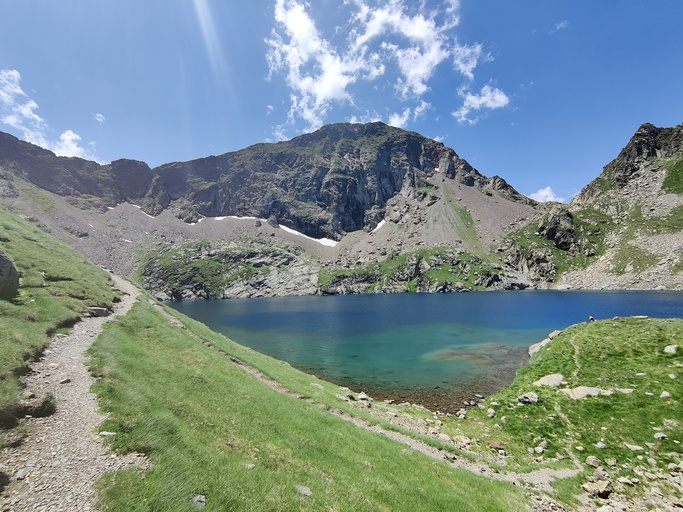
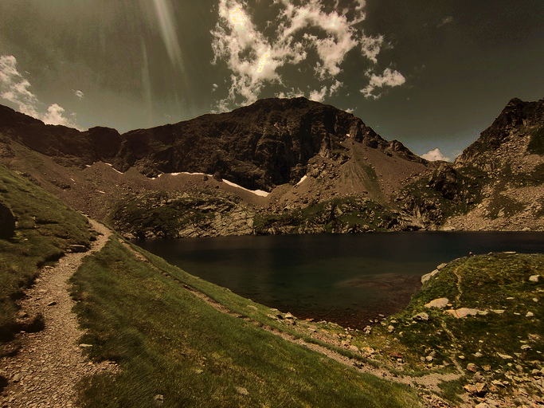

# Image Histogram Retargeting
Using Sliced Optimal Transport. Inspired by [Atrix256's article](https://blog.demofox.org/2023/11/25/interpolating-color-image-histograms-using-sliced-optimal-transport/)

# Example
| Original  | Target | Re-targeted |
| --------  | ------ | ----------- |
|  | |  |

# Usage
```bash
cargo build -r
target/release/color_transfer -s data/mountains.jpg -t data/bigcat.png -d data/retargeted.png
```

See `target/release/color_transfer -h` for options.
